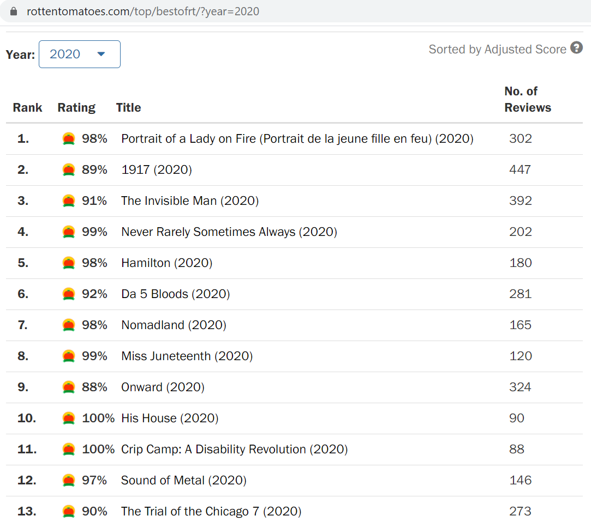

La idea del proyecto que se expone a continuación consiste en extraer información de la pag web rottentomatoes mediante web scraping. En concreto, la página web contiene información sobre películas. El objetivo final es obtener un dataset en el que cada registro contiene información sobre una determinada película. Cada columna hará referencia a un tipo de información extraída, como puede ser por ejemplo el diretor, el género o el año de producción de la película.

Las librerías usadas en el proyecto son las siguientes:
- tidyverse
- rvest
- stringr
- rebus

Unas se encargan de la parte de la extracción de la información en crudo (tidyverse y rvest) y el resto se encarga de preprocesar y limpiar la información obtenida (librerías para expresiones regulares).

```{r include=FALSE}

# 0.LIBRARIES ---------------------------------------------------------------

library(tidyverse)
library(rvest)
library(stringr)
library(rebus)
#library(lubridate)

```


El primer paso es conseguir todas las urls en las que aparece información relativa a las películas top para un año en concreto. Para ello, ha sido importante fijarse en la estructura del https, ya que para cada año lo único que cambia del https es justo el final. Todas las urls se almacenan en un character vector. 
La información extraída hace referencia a películas que van desde `first_year` hasta `final_year`.

```{r}
# 1.GETTING URLS (one url per year) ----------------------------------------------------------

get_urls = function(first_year,final_year){
  
  years = first_year:final_year
  urls = character(length(years))
  for(i in 1:length(years)){
    urls[i] = paste0('https://www.rottentomatoes.com/top/bestofrt/?year=',years[i])
  }
  urls
}

first_year = 2015   #antes de 1950 no hay información publicada en la web !
final_year = 2019   #cualquier año desde 1950 hasta 2020
urls = get_urls(first_year,final_year)

```


El siguiente paso consiste en definir una serie de funciones que extraerán información de cada url anterior. En concreto, se extrae información del rank, rating, title and number of reviews. 

Es muy importante resaltar que a lo largo de todo el proyecto se ha utilizado la extensión de google chrome llamada SelectorGadget, la cual ha facilitado en gran medida la obtención de los nodos y tags del código html.

Además, el uso de expresiones regulares del paquete stringr han sido fundamentales para preprocesar y limpiar la información contenida en el html.

La obtención limpia de la información ha sido un proceso totalmente iterativo de prueba y error hasta conseguir lo que se desea.

```{r}

# 2.GETTERS -----------------------------------------------------------------

### A) INFO CONTAINED IN URL RELATED TO YEAR -----------------------------------

### 2.1.rankings----------------------------------------------------------------
get_rankings = function(html){
  
  html %>%
    html_nodes(".table .bold") %>%
    html_text(trim=TRUE) %>%
    unlist() %>%
    as.integer()
}

### 2.2.ratings-----------------------------------------------------------------
get_ratings = function(html){
  
  raw_ratings = html %>%
                  html_nodes("#top_movies_main .tMeterScore") %>%
                  html_text(trim=TRUE) %>%
                  unlist()
  
  sapply(str_extract_all(raw_ratings,"\\d+(?=%)"),as.numeric)
  
}

### 2.3.titles------------------------------------------------------------------
get_titles = function(html){
  
  raw_titles = html %>% 
                html_nodes('#top_movies_main .articleLink') %>%      
                html_text(trim=TRUE) %>% 
                unlist()
  
  list_of_characterVectors = strsplit(raw_titles," ")
  sapply(list_of_characterVectors,
         function(characterVector) paste(characterVector[-length(characterVector)],collapse = ' ')
  )
}


### 2.4.years-------------------------------------------------------------------
year_extractor = function(string){
  
  vector = gsub("[\\(\\)]", "", regmatches(string, gregexpr("\\(.*?\\)", string))[[1]])
  as.numeric(tail(vector, n=1))
}


get_years = function(html){
  
  raw_titles = html %>% 
                html_nodes('#top_movies_main .articleLink') %>%      
                html_text(trim=TRUE) %>% 
                unlist()
  
  years = numeric(length(raw_titles))
  for(i in 1:length(raw_titles)){
    years[i] = year_extractor(raw_titles[i])
  }
  years
}

### 2.5.numbers of reviews------------------------------------------------------
get_num_reviews = function(html){
  
  html %>% 
    html_nodes('td.hidden-xs') %>%      
    html_text(trim=TRUE) %>% 
    unlist() %>%
    as.integer()
}
```


Una vez se ha extraido la información anterior, lo cual corresponde al primer nivel, ahora toca meterse dentro de la url de cada película para extraer más información, aparte de la ya obtenida previamente. Para esclarecer lo anterior se tienen en cuenta las siguientes imágenes:


IMAGEN 1 (correspondiente a la información del primer nivel)



IMAGEN 2 (correspondiente a la información del segundo nivel)


Cada uno de los títulos de las películas que aparecen en el primer nivel es un enlace a información sobre dicha película, por tanto, el siguiente paso es obtener las urls para cada película para cada año. Además, para cada película se extaerá la siguiente información: box office, run time, genre, director y language. Es importante resaltar que todos esos campos no están disponibles para todas las películas, es decir, habrá películas para las cuales no sea posible acceder a dicha información porque la página web no la ha recolectado (de ahí los else que se incluyen en las funciones).

El proceso para extraer la información y preprocesarla y limpiarla vuelve a ser un proceso iterativo y laborioso de prueba-error en el que es fundamental el uso de expresiones regulares.

```{r}

### B) INFO CONTAINED IN SUBURL RELATED TO MOVIES INSIDE A YEAR-----------------------------------------------------------------------

### 2.6.sublinks (links of movies in a particular year)-------------------------------------
get_sublinks = function(html){
  
  ending_links = html %>% 
    html_nodes('#top_movies_main .articleLink') %>%      
    html_attr('href')  
  
  complete_links = character(length(ending_links))
  for(i in 1:length(ending_links)){
    complete_links[i] = paste0("https://www.rottentomatoes.com",ending_links[i])    
  }
  complete_links
}

### 2.7.box office--------------------------------------------------------------
get_box_offices = function(html){
  
  links_of_titles = get_sublinks(html)
  box_office_label = "Box Office (Gross USA):"
  
  vector_of_box_offices = character(length = length(links_of_titles))
  for(i in 1:length(links_of_titles)){
    
    labels = read_html(links_of_titles[i]) %>% 
      html_nodes('.meta-label') %>%      
      html_text(trim=TRUE)
    
    if(box_office_label %in% labels){
      index = which(box_office_label==labels)
      value = read_html(links_of_titles[i]) %>% 
        html_nodes('.meta-value') %>%      
        html_text(trim=TRUE) %>%
        .[index]
      vector_of_box_offices[i] = value
    }else{
      vector_of_box_offices[i] = "NO DISPONIBLE"
    }
    
  }
  vector_of_box_offices
}

### 2.8.duration time-----------------------------------------------------------
get_duration_times = function(html){
  
  links_of_titles = get_sublinks(html)
  runtime_label = "Runtime:"
  
  vector_of_duration_times = character(length = length(links_of_titles))
  for(i in 1:length(links_of_titles)){
    
    labels = read_html(links_of_titles[i]) %>% 
      html_nodes('.meta-label') %>%      
      html_text(trim=TRUE)
    
    if(runtime_label %in% labels){
      index = which(runtime_label==labels)
      run_time = read_html(links_of_titles[i]) %>% 
        html_nodes('.meta-value') %>%      
        html_text(trim=TRUE) %>%
        .[index]
      vector_of_duration_times[i] = run_time
    }else{
      vector_of_duration_times[i] = "NO DISPONIBLE"
    }
    
  }
  vector_of_duration_times
}

### 2.9.genre-------------------------------------------------------------------
preprocess_genre = function(raw_genre){
  
  stage_0 = raw_genre
  stage_1 = gsub("\n", "", stage_0, fixed = TRUE)
  stage_2 = unlist(str_split(stage_1, ","))
  stage_3 = gsub("^\\s+|\\s+$", "", stage_2)
  stage_4 = paste0(stage_3,collapse = " | ")
  stage_4
}

get_genres = function(html){
  
  links_of_titles = get_sublinks(html)
  genre_label = "Genre:"
  
  vector_of_genres = character(length = length(links_of_titles))
  for(i in 1:length(links_of_titles)){
    
    labels = read_html(links_of_titles[i]) %>% 
                html_nodes('.meta-label') %>%      
                html_text(trim=TRUE)
    
    if(genre_label %in% labels){
      index = which(genre_label==labels)
      raw_genre = read_html(links_of_titles[i]) %>% 
                    html_nodes('.meta-value') %>%      
                    html_text(trim=TRUE) %>%
                    .[index]
      vector_of_genres[i] = preprocess_genre(raw_genre)
    }else{
      vector_of_genres[i] = "NO DISPONIBLE"
    }
    
  }
  vector_of_genres
}

### 2.10.director---------------------------------------------------------------
preprocess_director = function(raw_director){
  
  stage_0 = raw_director
  stage_1 = gsub("\n", "", stage_0, fixed = TRUE)
  stage_2 = unlist(str_split(stage_1, ","))
  stage_3 = gsub("^\\s+|\\s+$", "", stage_2)
  stage_4 = paste0(stage_3,collapse = " | ")
  stage_4
}

get_directors = function(html){
  
  links_of_titles = get_sublinks(html)
  director_label = "Director:"
  
  vector_of_directors = character(length = length(links_of_titles))
  for(i in 1:length(links_of_titles)){
    
    labels = read_html(links_of_titles[i]) %>% 
      html_nodes('.meta-label') %>%      
      html_text(trim=TRUE)
    
    if(director_label %in% labels){
      index = which(director_label==labels)
      raw_director = read_html(links_of_titles[i]) %>% 
        html_nodes('.meta-value') %>%      
        html_text(trim=TRUE) %>%
        .[index]
      vector_of_directors[i] = preprocess_director(raw_director)
    }else{
      vector_of_directors[i] = "NO DISPONIBLE"
    }
    
  }
  vector_of_directors
}


### 2.11.language---------------------------------------------------------------


get_languages = function(html){
  
  links_of_titles = get_sublinks(html)
  language_label = "Original Language:"
  
  vector_of_languages = character(length = length(links_of_titles))
  for(i in 1:length(links_of_titles)){
    
    labels = read_html(links_of_titles[i]) %>% 
                html_nodes('.meta-label') %>%      
                html_text(trim=TRUE)
    
    if(language_label %in% labels){
      index = which(language_label==labels)
      raw_language = read_html(links_of_titles[i]) %>% 
                        html_nodes('.meta-value') %>%      
                        html_text(trim=TRUE) %>%
                        .[index]
      
      vector_of_languages[i] = raw_language
    }else{
      vector_of_languages[i] = "NO DISPONIBLE"
    }
    
  }
  vector_of_languages
}


```


La información obtenida se almacenará en un dataframe. Para ello, se crea una primera función que extrae toda la información que nos interesa dado un html (tanto la contenida en el primer nivel como la contenida en el segundo nivel). Es decir, dado un año, la función extrae toda la información para cada película.

Después se crea una segunda función, que hace de wrapper de la primera, de tal forma que el input de la función pasa a ser una url en vez de un html.

El siguiente paso es realizar un map de la anterior función para cada año, es decir, para cada url se extrae toda la información, que por defecto se almacena en una lista (lo que se obtiene es una lista de dataframes, es decir, un dataframe por año).

Por último, se aplica un bind_rows para concatenar todos los dataframes contenidos en la lista anterior y así obtener un dataframe definitivo con toda la información de todas las películas de todos los años.

```{r}

# 3.COMBINE THE DATA INTO A DATAFRAME --------------------------------------------------

# get data into a dataframe from a html
get_data_table = function(html){
  
  rankings = get_rankings(html)
  ratings = get_ratings(html)
  titles = get_titles(html)
  years = get_years(html)
  numbers_of_reviews = get_num_reviews(html)
  box_offices = get_box_offices(html)
  duration_times = get_duration_times(html)
  genres = get_genres(html)
  directors = get_directors(html)
  languages = get_languages(html)
  
  df = data.frame(ranking = rankings,
                  rating = ratings,
                  title = titles,
                  year = years,
                  number_of_reviews = numbers_of_reviews,
                  box_office = box_offices,
                  duration_time = duration_times,
                  genre = genres,
                  director = directors,
                  language = languages
                  )
  
  df
}

# is more conveniently wrapping the previous function to just use url as argument
get_data_from_url = function(url){
  
  html = read_html(url)
  get_data_table(html)
}

# create a list of dataframes (one dataframe per year)
list_of_dataframes = map(urls,get_data_from_url)

# binding the dataframes contained in the list of dataframes
web_scrapping_df = bind_rows(list_of_dataframes)

head(web_scrapping_df,10)
```


```{r}
dim(web_scrapping_df)
```


Como conclusiones generales del proyecto se destaca la dificultad del manejo de expresiones regulares, las cuales han sido imprescindibles a la hora de limpiar la información. Por otro lado, el uso de la extensión Selector Gadget ha facilitado en gran medida la navegación y la extracción de información del html, ya que permite localizar la información sin necesidad de saber demasiado de html. Finalmente, no se ha procedido a analizar la información extraída por falta de tiempo, pero habría sido interesante haber hecho un pequeño análisis.
